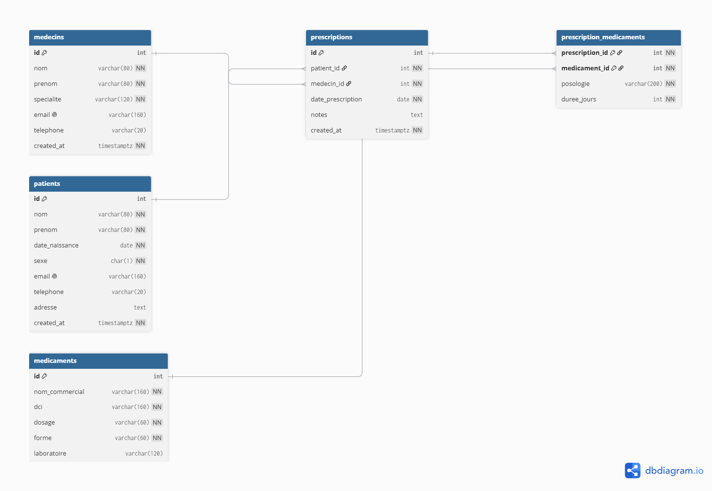
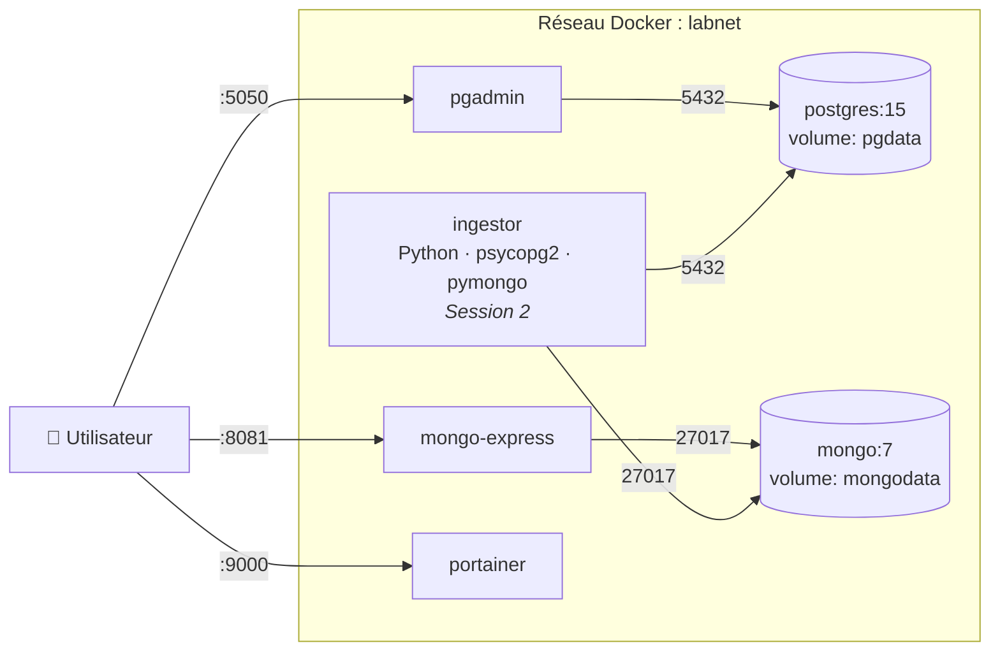

# 🧪 Labo Santé — Architecture de données containerisée

> **TP Data Architecture for AI — MSc 2025-2026**
> Concevoir et déployer une architecture de données containerisée pour un projet IA.

[](#-avancement) [](#-avancement) [](#-avancement)
[](https://www.postgresql.org/) [](https://www.mongodb.com/) [](https://docs.docker.com/compose/)

---

## 🎯 Contexte

Un **laboratoire de santé fictif** souhaite centraliser ses données médicales aujourd'hui éclatées dans plusieurs fichiers et logiciels métier. Le projet construit une plateforme :

- **fiable** — intégrité référentielle, persistance entre redémarrages
- **scalable** — capable d'ingérer plusieurs millions de consultations
- **administrable** — UIs web pour explorer les données
- **observable** — monitoring temps réel des services
- **portable** — tout est containerisé, déployable en une commande

À terme, ces données alimenteront des modèles IA (prédiction de prescription, détection d'interactions médicamenteuses, NLP sur les consultations).

## 🧱 Stack technique

| Brique | Choix | Pourquoi |
|---|---|---|
| Données structurées | **PostgreSQL 15** | schéma stable (médecins, patients, médicaments, prescriptions), jointures, intégrité forte |
| Données semi-structurées | **MongoDB 7** | consultations à structure variable (symptômes, diagnostics), pas de jointures complexes |
| UI Postgres | **pgAdmin 4** | exploration et requêtes ad-hoc |
| UI Mongo | **Mongo Express** | navigation collections |
| Monitoring Docker | **Portainer CE** | dashboard conteneurs, logs, métriques |
| Orchestration | **Docker Compose** | reproductibilité, isolation réseau |
| Pipeline (Session 2) | **Python · psycopg2 · pymongo** | ingestion paramétrable, mesure de volumétrie |

## 🗂️ Structure du dépôt

```
labo-sante/
├── README.md                       ← ce fichier (suivi du projet)
├── docker-compose.yml              ← 5 services (postgres, mongo, pgadmin, mongo-express, portainer)
├── .env.example                    ← variables à recopier dans .env (jamais commité)
├── .gitignore
├── sql/
│   ├── schema.sql                  ← DDL Postgres auto-exécuté au 1er démarrage
│   └── dbdiagram.dbml              ← source dbdiagram.io
├── mongo/
│   └── consultation-schema.json    ← schéma logique d'un document `consultation` + justification NoSQL
└── docs/
    ├── cahier-des-charges.md       ← contexte, besoins fonctionnels & techniques, critères d'acceptation
    ├── architecture.md             ← diagramme Mermaid des services
    ├── schema.png                  ← export PNG du schéma SQL (dbdiagram.io)
    ├── schema.pdf                  ← export PDF
    └── schema.svg                  ← export SVG vectoriel
```

## 📊 Avancement

| Session | Thème | Statut | Livrables |
|:---:|---|:---:|---|
| **1** | Modélisation & premiers conteneurs | ✅ **DONE** | cahier des charges, schémas SQL/NoSQL, diagramme services, stack démarre |
| **2** | Docker Compose & pipeline d'ingestion | ⏳ TODO | `docker-compose.yml` complet, Dockerfile Python, scripts d'ingestion, tests volumétrie (60k / 600k / 6M) |
| **3** | Monitoring, qualité, soutenance | ⏳ TODO | captures Portainer, `docker stats`, livrable final consolidé |

---

## ✅ Session 1 — Détail des livrables

### 1. Cahier des charges → [`docs/cahier-des-charges.md`](./docs/cahier-des-charges.md)

Décrit :

- le **contexte** (labo santé fictif, données aujourd'hui éclatées)
- les **5 domaines de données** et leur stockage cible justifié
- **6 besoins fonctionnels** (F1–F6) : enregistrement, prescriptions, consultations, ingestion masse, idempotence, monitoring
- les **besoins techniques** (conteneurisation, persistance, réseau, secrets, ordonnancement, observabilité, reproductibilité)
- le **périmètre** (inclus / hors périmètre)
- les **critères d'acceptation** mesurables

### 2. Schéma SQL → [`sql/schema.sql`](./sql/schema.sql) + [`sql/dbdiagram.dbml`](./sql/dbdiagram.dbml)

**5 tables** PostgreSQL :

| Table | Rôle | Clés |
|---|---|---|
| `medecins` | référentiel praticiens | PK `id`, UNIQUE `email` |
| `patients` | référentiel patients | PK `id`, UNIQUE `email`, CHECK `sexe IN ('M','F','X')` |
| `medicaments` | référentiel médicaments | PK `id`, UNIQUE `(nom_commercial, dosage, forme)` |
| `prescriptions` | actes de prescription | PK `id`, FK `patient_id`, FK `medecin_id` |
| `prescription_medicaments` | liaison N-N | PK composite `(prescription_id, medicament_id)` |

**Contraintes** : FKs avec `ON DELETE RESTRICT` (sauf cascade sur la liaison N-N), `duree_jours > 0`, timestamps automatiques.
**Index** : `patient_id`, `medecin_id`, `date_prescription`, `dci`.
**Auto-exécution** : `schema.sql` est monté dans `/docker-entrypoint-initdb.d/` → DDL appliquée au tout premier `docker compose up`.

#### 📐 Diagramme exporté depuis dbdiagram.io

🔗 **Lien éditable** : https://dbdiagram.io/d/Labo-Sante-Schema-SQL-6a27e6f88eb8ca4bfe863a2b



Exports disponibles : [PNG](./docs/schema.png) · [PDF](./docs/schema.pdf) · [SVG](./docs/schema.svg)

### 3. Schéma NoSQL → [`mongo/consultation-schema.json`](./mongo/consultation-schema.json)

Collection unique `consultations`. Exemple de document :

```json
{
  "_id": "ObjectId(...)",
  "patient_id": 1428,
  "medecin_id": 12,
  "date": "2026-06-09T09:30:00Z",
  "symptoms": [
    { "label": "toux sèche", "duree_jours": 10, "intensite": "moderee" },
    { "label": "fièvre", "temperature_c": 38.4 }
  ],
  "diagnosis": {
    "primary":   { "code_cim10": "J20.9", "label": "Bronchite aiguë" },
    "secondary": [{ "code_cim10": "R05", "label": "Toux" }],
    "severity":  "moderee",
    "confidence": 0.82
  },
  "notes": "Auscultation : râles bronchiques bilatéraux."
}
```

**Pourquoi NoSQL ici ?**

- `symptoms` et `diagnosis` ont une **longueur et une structure variables** (impossible à modéliser proprement en SQL sans 5+ tables).
- **Pas de jointure complexe** nécessaire sur ce document.
- `patient_id` assure le **lien logique avec PostgreSQL** (jointure applicative côté ingestor / API).
- Évolution facile du modèle : ajouter `examens_demandes`, `attachments`… **sans migration**.

**Index recommandés** : `patient_id ASC`, `date DESC`, `diagnosis.primary.code_cim10 ASC`.

### 4. Diagramme des services → [`docs/architecture.md`](./docs/architecture.md)



**5 services** dans un réseau Docker isolé (`labnet`), communication par **nom de service** (`postgres`, `mongo`…). Volumes nommés (`pgdata`, `mongodata`, `pgadmin`, `portainer`) pour la persistance.

| Service | Image | Port hôte | Healthcheck |
|---|---|---|---|
| postgres | `postgres:15-alpine` | 127.0.0.1:**5432** | `pg_isready` |
| mongo | `mongo:7` | 127.0.0.1:**27017** | `db.adminCommand('ping')` |
| pgadmin | `dpage/pgadmin4` | 127.0.0.1:**5050** | dépend de postgres `healthy` |
| mongo-express | `mongo-express:1` | 127.0.0.1:**8081** | dépend de mongo `healthy` |
| portainer | `portainer/portainer-ce` | 127.0.0.1:**9000** | — |

### 5. Stack qui démarre → [`docker-compose.yml`](./docker-compose.yml) + [`.env.example`](./.env.example)

- Aucun mot de passe en dur (variables `${VAR}` → `.env`)
- Ports admin exposés **uniquement sur 127.0.0.1** (durcissement de base)
- `depends_on: condition: service_healthy` pour les UIs
- `.env` strictement exclu via `.gitignore`

---

## 🚀 Démarrer le projet

```bash
# 1. Cloner
git clone https://github.com/Almaire-Lab/labo-sante.git
cd labo-sante

# 2. Configurer les secrets
cp .env.example .env
# (éditer .env et mettre de vrais mots de passe)

# 3. Lancer la stack
docker compose up -d

# 4. Vérifier que tout est UP et healthy
docker compose ps
```

### Accès aux UIs

| Service | URL | Identifiants |
|---|---|---|
| pgAdmin | http://localhost:5050 | `PGADMIN_EMAIL` / `PGADMIN_PASSWORD` (`.env`) |
| Mongo Express | http://localhost:8081 | `MEX_USER` / `MEX_PASSWORD` (`.env`) |
| Portainer | http://localhost:9000 | à créer au 1er accès |

### Vérifier le schéma SQL appliqué

```bash
docker exec -it labo-postgres psql -U $POSTGRES_USER -d $POSTGRES_DB -c "\dt"
```

Doit lister : `medecins`, `patients`, `medicaments`, `prescriptions`, `prescription_medicaments`.

### Connecter pgAdmin à Postgres

Dans pgAdmin → *Add new server* :

- **Name** : `labo`
- **Host** : `postgres` ← nom du **service**, pas `localhost`
- **Port** : `5432`
- **User / Password** : valeurs du `.env`

### Arrêt / nettoyage

```bash
docker compose down            # stoppe les conteneurs, GARDE les volumes
docker compose down -v         # ⚠ supprime aussi les volumes (perte de données)
```

---

## 🗺️ Roadmap

### Session 2 — Ingestion & volumétrie *(à venir)*

- [ ] Service `ingestor` Python (Dockerfile + `requirements.txt`)
- [ ] `app/generate_data.py` — générateur paramétrable (`--n` lignes)
- [ ] `app/ingest_postgres.py` (psycopg2) — référentiels + prescriptions
- [ ] `app/ingest_mongo.py` (pymongo) — consultations
- [ ] Idempotence (upsert ou contrainte unique)
- [ ] Tests : **60 000**, **600 000**, **6 000 000** lignes
- [ ] Mesures : temps total, RAM, CPU
- [ ] `app/README.md` avec résultats

### Session 3 — Monitoring & soutenance *(à venir)*

- [ ] Capture dashboard Portainer pendant ingestion
- [ ] Sortie `docker stats` pendant ingestion (avant/pendant/après)
- [ ] Compilation du **livrable final** (`docs/livrable-final.md`) :
  cahier des charges + schémas + diagramme + extraits commentés du compose + captures + doc d'utilisation

---

## 👤 Auteur

Aline Maire — MSc 2025-2026, module *Data Architecture for AI* (Matthieu).

## 📜 Licence

Projet pédagogique — usage académique uniquement. Données 100 % synthétiques (aucune donnée personnelle réelle).
