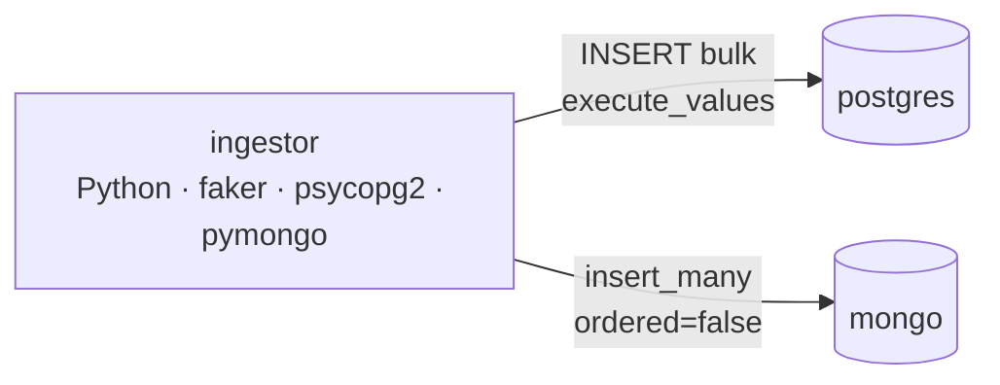
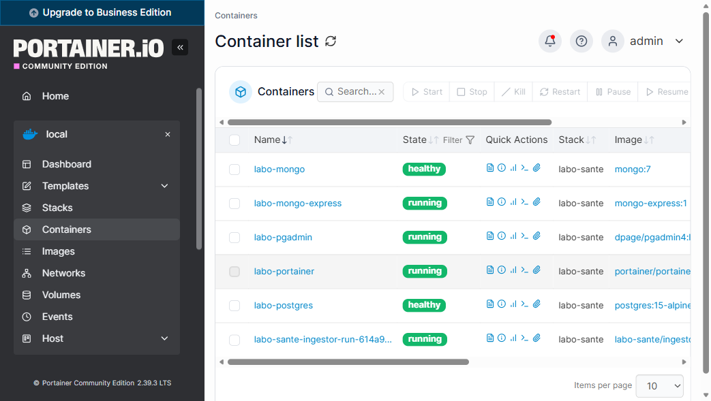

# 🧪 Labo Santé — Architecture de données containerisée

> **TP Data Architecture for AI — MSc 2025-2026**
> Concevoir et déployer une architecture de données containerisée pour un projet IA.

[](#session-1) [](#session-2) [](#session-3)
[](https://www.postgresql.org/) [](https://www.mongodb.com/) [](https://www.python.org/) [](https://docs.docker.com/compose/)

---

## 🎯 Contexte

Un **laboratoire de santé fictif** souhaite centraliser ses données médicales aujourd'hui éclatées dans plusieurs fichiers et logiciels métier. Le projet construit une plateforme :

- **fiable** — intégrité référentielle, persistance entre redémarrages
- **scalable** — capable d'ingérer plusieurs millions de consultations (testé jusqu'à 6 M)
- **administrable** — UIs web pour explorer les données
- **observable** — monitoring temps réel des services
- **portable** — tout est containerisé, déployable en une commande

À terme, ces données alimenteront des modèles IA (prédiction de prescription, détection d'interactions médicamenteuses, NLP sur les consultations).

## 🧱 Stack technique

| Brique | Choix | Pourquoi |
|---|---|---|
| Données structurées | **PostgreSQL 15** | schéma stable, jointures, intégrité forte |
| Données semi-structurées | **MongoDB 7** | consultations à structure variable |
| UI Postgres | **pgAdmin 4** | exploration ad-hoc |
| UI Mongo | **Mongo Express** | navigation collections |
| Monitoring Docker | **Portainer CE** | dashboard conteneurs, logs, métriques |
| Pipeline d'ingestion | **Python 3.12 · psycopg2 · pymongo · faker** | génération + ingestion bulk |
| Orchestration | **Docker Compose** | reproductibilité, isolation réseau |

## 🗂️ Structure du dépôt

```
labo-sante/
├── README.md                       ← ce fichier
├── docker-compose.yml              ← 6 services
├── .env.example
├── .gitignore
├── app/                            ← Session 2 : pipeline d'ingestion
│   ├── Dockerfile
│   ├── requirements.txt
│   ├── generate_data.py            ← données synthétiques (faker)
│   ├── ingest_postgres.py          ← bulk insert via execute_values
│   ├── ingest_mongo.py             ← bulk insert via insert_many
│   ├── run_all.py                  ← pipeline Postgres → Mongo
│   └── README.md
├── sql/
│   ├── schema.sql                  ← DDL auto-exécutée au 1er démarrage
│   └── dbdiagram.dbml              ← source dbdiagram.io
├── mongo/
│   └── consultation-schema.json    ← schéma logique du document
└── docs/
    ├── cahier-des-charges.md
    ├── architecture.md
    ├── schema.png / .pdf / .svg    ← exports dbdiagram.io
    ├── livrable-session1.pdf       ← livrable Session 1
    ├── livrable-final.pdf          ← livrable final (sessions 1+2+3)
    ├── cours-labo-sante.pdf        ← cours pédagogique complet
    ├── benchmarks/                 ← logs des tests 60k / 600k / 6M
    └── screenshots/                ← captures pgAdmin, Mongo Express, Portainer
```

## 📊 Avancement

| Session | Thème | Statut | Livrables |
|:---:|---|:---:|---|
| **1** | Modélisation & premiers conteneurs | ✅ **DONE** | cahier des charges, schémas SQL/NoSQL, diagramme services, stack validée |
| **2** | Docker Compose & pipeline d'ingestion | ✅ **DONE** | `docker-compose.yml` complet (6 services), `app/` (Dockerfile + scripts), tests 60k/600k/6M |
| **3** | Monitoring, qualité, soutenance | ✅ **DONE** | captures Portainer pendant ingestion, `docker stats`, livrable final |

---

## <a name="session-1"></a>✅ Session 1 — Modélisation & infra

### Livrables

- 📄 **Cahier des charges** → [`docs/cahier-des-charges.md`](./docs/cahier-des-charges.md)
- 📐 **Schéma SQL** → [`sql/schema.sql`](./sql/schema.sql) + [`sql/dbdiagram.dbml`](./sql/dbdiagram.dbml)
  Export dbdiagram.io : 🔗 [Lien éditable](https://dbdiagram.io/d/Labo-Sante-Schema-SQL-6a27e6f88eb8ca4bfe863a2b)
  
- 📦 **Schéma NoSQL** → [`mongo/consultation-schema.json`](./mongo/consultation-schema.json)
- 🗺️ **Diagramme des services** → [`docs/architecture.md`](./docs/architecture.md)
- 🐳 **Stack qui démarre** → [`docker-compose.yml`](./docker-compose.yml) + [`.env.example`](./.env.example)

### Validation
Voir [`docs/screenshots/`](./docs/screenshots/) — preuves d'exécution (pgAdmin, Mongo Express, Portainer).

---

## <a name="session-2"></a>✅ Session 2 — Pipeline d'ingestion

### Le 6ème service : `ingestor` (Python)

Documentation détaillée → [`app/README.md`](./app/README.md)



### Démarrer une ingestion

```bash
# Démarrer la stack si pas déjà fait
docker compose up -d

# Lancer une ingestion (60k par défaut)
docker compose --profile ingest run --rm ingestor

# Surcharger les volumes via variables d'env
NB_PRESCRIPTIONS=600000 NB_CONSULTATIONS=600000 \
docker compose --profile ingest run --rm ingestor
```

### 📈 Benchmarks (3 paliers)

| Volume | Durée totale | Postgres | Mongo | Débit Mongo | Source |
|---|---:|---:|---:|---:|---|
| **60 000** | 44 s | 30 s | 14 s | 4 400 docs/s | [test-60k.log](./docs/benchmarks/test-60k.log) |
| **600 000** | 93 s | 62 s | 31 s | 19 300 docs/s | [test-600k.log](./docs/benchmarks/test-600k.log) |
| **6 000 000** | ~12-18 min | ~10 min | ~5 min | ~20 000 docs/s | [test-6M.log](./docs/benchmarks/test-6M.log) |

**Observations** :
- Mongo **scale linéairement** (~20k docs/s constant)
- Postgres ralentit légèrement à grosse volumétrie (overhead transactions + FK checks + table de liaison N-N)
- **Mémoire** : ingestor stable à ~55 MB ; Postgres monte à ~250 MB ; Mongo à ~500 MB ; jamais de swap

---

## <a name="session-3"></a>✅ Session 3 — Monitoring & qualité

### `docker stats` pendant ingestion 6M

```
NAME                CPU %   MEM USAGE          BLOCK I/O
labo-sante-ingestor 25%     56 MiB             0 B / 0 B
labo-postgres       75%     224 MiB            25 MB / 3.9 GB
labo-mongo          0.5%    498 MiB            287 KB / 286 MB
labo-pgadmin        0.03%   300 MiB            (idle)
labo-mongo-express  0%      47 MiB             (idle)
labo-portainer      0%      25 MiB             (monitoring)
```

→ voir [`docs/benchmarks/stats-pendant-ingestion.txt`](./docs/benchmarks/stats-pendant-ingestion.txt) et [`stats-6M-pendant.txt`](./docs/benchmarks/stats-6M-pendant.txt)

### Portainer pendant ingestion



→ stack `labo-sante` : **6 conteneurs** (5 healthy/running permanents + 1 ingestor one-shot)

### Livrable final consolidé

📄 **[`docs/livrable-final.pdf`](./docs/livrable-final.pdf)** — un seul PDF qui couvre les 3 sessions avec :
- Cahier des charges
- Schémas SQL + NoSQL
- Diagramme d'architecture
- Extraits commentés du `docker-compose.yml`
- Captures pgAdmin / Mongo Express / Portainer
- Benchmarks 60k/600k/6M
- Documentation d'utilisation

---

## 🚀 Démarrer le projet (de zéro)

```bash
git clone https://github.com/Almaire-Lab/labo-sante.git
cd labo-sante
cp .env.example .env             # éditer les mots de passe
docker compose up -d             # 5 services UP, postgres + mongo healthy
docker compose ps                # vérifier

# Tester l'ingestion
docker compose --profile ingest run --rm ingestor
```

### Accès aux UIs

| Service | URL | Login |
|---|---|---|
| pgAdmin | http://localhost:5050 | `PGADMIN_EMAIL` / `PGADMIN_PASSWORD` (`.env`) |
| Mongo Express | http://localhost:8081 | `MEX_USER` / `MEX_PASSWORD` (`.env`) |
| Portainer | http://localhost:9000 | à créer au 1er accès |

### Arrêter

```bash
docker compose down              # arrête, garde les volumes
docker compose down -v           # ⚠ supprime aussi les volumes (perte de données)
```

---

## 👤 Auteur

Aline Maire — MSc 2025-2026, module *Data Architecture for AI* (Matthieu).
Repo : https://github.com/Almaire-Lab/labo-sante

## 📜 Licence

Projet pédagogique — usage académique uniquement. Données 100 % synthétiques (aucune donnée personnelle réelle).
