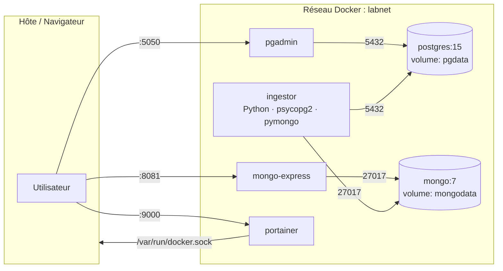

# Architecture des services

Tous les services tournent dans un **réseau Docker isolé** (`labnet`). Ils communiquent par leur **nom de service** (pas `localhost`). Les volumes nommés (`pgdata`, `mongodata`) assurent la persistance entre `docker compose down` / `up`.

## Diagramme (Mermaid)

## Tableau des services (Session 1)

| Service        | Image                        | Port hôte | Volume       | Dépend de        |
|----------------|------------------------------|-----------|--------------|------------------|
| postgres       | `postgres:15-alpine`         | 5432      | `pgdata`     | —                |
| mongo          | `mongo:7`                    | 27017     | `mongodata`  | —                |
| pgadmin        | `dpage/pgadmin4:latest`      | 5050      | `pgadmin`    | postgres (healthy) |
| mongo-express  | `mongo-express:1`            | 8081      | —            | mongo (healthy)  |
| portainer      | `portainer/portainer-ce`     | 9000      | `portainer`  | —                |

(Le service `ingestor` arrive en Session 2.)

## Healthchecks

- **postgres** : `pg_isready -U $POSTGRES_USER -d $POSTGRES_DB`
- **mongo** : `mongosh --eval "db.adminCommand('ping')"`

Les UIs (`pgadmin`, `mongo-express`) ne démarrent qu'après `service_healthy` → évite les erreurs « connection refused » au boot.

## Sécurité

- Aucun mot de passe en dur : tout passe par `.env` (non commité).
- `.env.example` documente les variables sans valeurs sensibles.
- Les ports admin sont exposés **uniquement sur `localhost`** (à durcir en prod).
